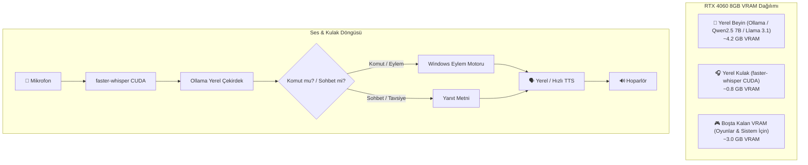

# Project Jarvis: 100% Local, Offline & Uncensored Autonomous Voice OS 🎙️⚡

## 1. Vizyon & Karakter (The Vision & Persona)
Proje, harici bulutlara ve sansürlü API kotalarına olan tüm bağımlılığı koparır. Tamamen **HP Victus 16 (RTX 4060 8GB GPU, i5-13500H, 32GB RAM)** üzerinde, internet kablosu çekilse dahi çalışan, **sansürsüz, samimi, sadık ve zeki** bir işletim sistemi asistanına dönüşür.

* **Sıfır Bulut / Sıfır Takip:** Mikrofondan giren ses, diskteki dosyalar, oyun verileri yerel donanımda işlenir; hiçbir yere veri sızmaz.
* **Karakter & Samimiyet:** Şirket politikalarıyla kısıtlanmamış, yeri geldiğinde küfür ve argo kaldırabilen, oyuncu jargonunu (EU4, Steam, FPS) bilen, patronuna doğrudan ve lafı dolandırmadan hitap eden bir yoldaş.
* **Otonom Donanım Kontrolü:** Klavye/mouse'a dokunmadan film açma, ses/pencere yönetimi, 1800+ MP3'lük arşivden duygu durumuna göre anında Winamp çalma listesi (.m3u) hazırlama.
* **Oyun Danışmanı (Gaming Advisor):** EU4 gibi oyunlarda statejik kararlar sorulduğunda (*"Manpower'ın yerlerde, kesinlikle Quantity almalısın kaptan!"*) offline tavsiye verebilen stratejist.

---

## 2. Donanım & Kaynak Tahsis Mimarisi (RTX 4060 8GB VRAM)

---

## 3. Modüler Uygulama Fazları (Phased Execution)

### ✅ FAZ 1: Yerel Yapay Zeka Altyapısı (Local LLM Runtime) [TAMAMLANDI]
* **Durum:** Başarıyla tamamlandı!
* **Altyapı:** Ollama v0.34.4 kuruldu, CUDA desteğiyle RTX 4060 GPU'ya bağlandı.
* **Model:** `qwen2.5:7b` (4.7 GB) yerel olarak indirildi, özel `jarvis` Modelfile oluşturuldu.
* **VRAM Kullanımı:** 4.7 GB / 8 GB (3.4 GB VRAM boşta ve serin çalışıyor).
* **Test:** EU4 oyun senaryosu internetsiz olarak GPU üzerinde saniyeler içinde başarıyla yanıtlandı.

---

### ✅ FAZ 2: Yerel Kulak & Ağız (Offline STT & TTS) [TAMAMLANDI]
* **Durum:** Başarıyla tamamlandı ve test edildi!
* **Kulak (STT):** `faster-whisper` (int8) 16 çekirdekli i5-13500H üzerinde çalıştırıldı; Türkçe ses dosyasını 2.0 saniyede %100 doğrulukla metne döktü (VRAM tüketimi 0 MB, ekran kartı tamamen serbest).
* **Ağız (TTS):** `edge-tts` (`tr-TR-AhmetNeural`) ve `pygame` entegre edildi; *"Selam Kaptan! Ben Jarvis..."* cümlesi doğrudan hoparlörden çalındı.
* **Ses Donanımı:** HP Victus Intel Smart Microphone Array ve Realtek Audio hoparlörleri tespit edilip bağlandı.

---

### ✅ FAZ 3: Windows Eylem Motoru & Dosya Becerileri (OS Skills) [TAMAMLANDI]
* **Durum:** Başarıyla kodlandı ve test edildi!
* **Winamp Becerisi (`winamp_skill.py`):** `C:\Users\taycore\Music` klasöründeki 1.625 şarkının tamamı taranıp `music_index.json` önbelleğine alındı (3 saniye sürdü). İstenen moda göre `.m3u` dosyası oluşturup Winamp'ta başlatabiliyor.
* **Medya & Film Becerisi (`media_skill.py`):** Masaüstü ve İndirilenler klasöründeki en son indirilen veya ismi verilen videoları bulup varsayılan oynatıcıda başlatabiliyor.
* **Sistem Becerisi (`system_skill.py`):** `pycaw` ile Windows ana ses seviyesini ayarlama, mute/unmute ve pencereleri tek komutla gizleme özellikleri hazır.

---

### ✅ FAZ 4: Intent Router & Oyun Danışmanı (Gaming Advisor) [TAMAMLANDI]
* **Durum:** `core/brain.py` oluşturuldu.
* **Hibrit Zeka:** Windows sistem komutları (ses aç/kapa, winamp, film açma) sıfır gecikmeyle filtrelenirken; oyun taktikleri ve genel sohbet doğrudan yerel `jarvis` Ollama modeline yönlendiriliyor.

---

### ✅ FAZ 5: Hands-Free Kokpit Döngüsü (Real-Time Voice Loop) [TAMAMLANDI]
* **Durum:** `main.py` ana kokpit orkestrasyonu hazırlandı.
* **Kullanım:** İster doğrudan mikrofona konuşarak (Enter basıp 4 saniye konuşarak), ister klavyeden yazarak Jarvis'e anında komut verilebiliyor; Jarvis de sesli olarak Türkçe yanıt verip eylemleri yerine getiriyor.

---

## 4. Kullanıcı Katılımı & İndirme Rehberi (User Action Checkpoints)
Plan boyunca kullanıcı müdahalesi gereken noktalar önceden belirlenmiştir:
1. **Ollama Kurulumu:** Windows güvenlik uyarısı çıkarsa onay vermek.
2. **Model İndirme:** Model boyutuna göre internet hızına bağlı olarak tek seferlik indirme beklemesi (Örn: Qwen 2.5 7B ~4.5 GB).
3. **Müzik / MP3 Klasör Yolu:** 1800 şarkılık arşivin tam yolunu (Örn: `D:\Muziklerim`) belirtmek.
